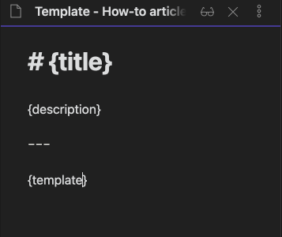
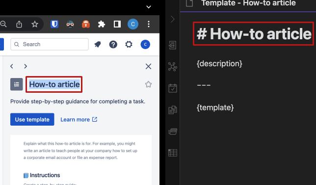
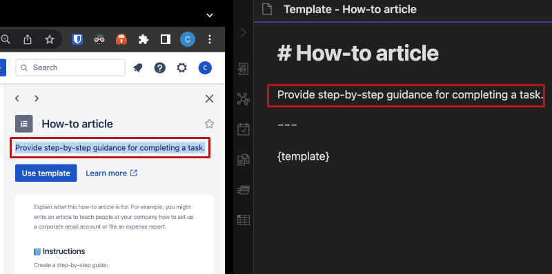
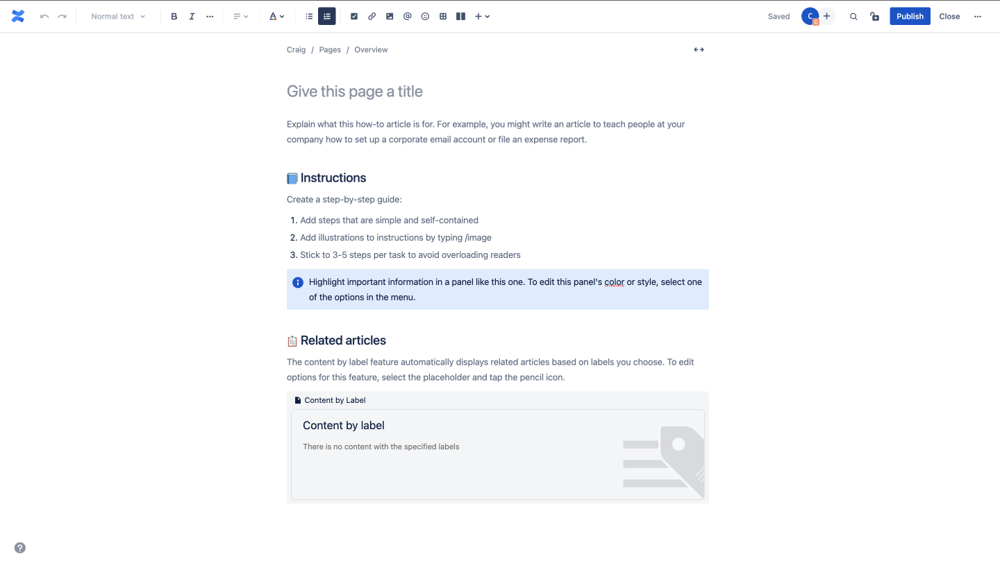
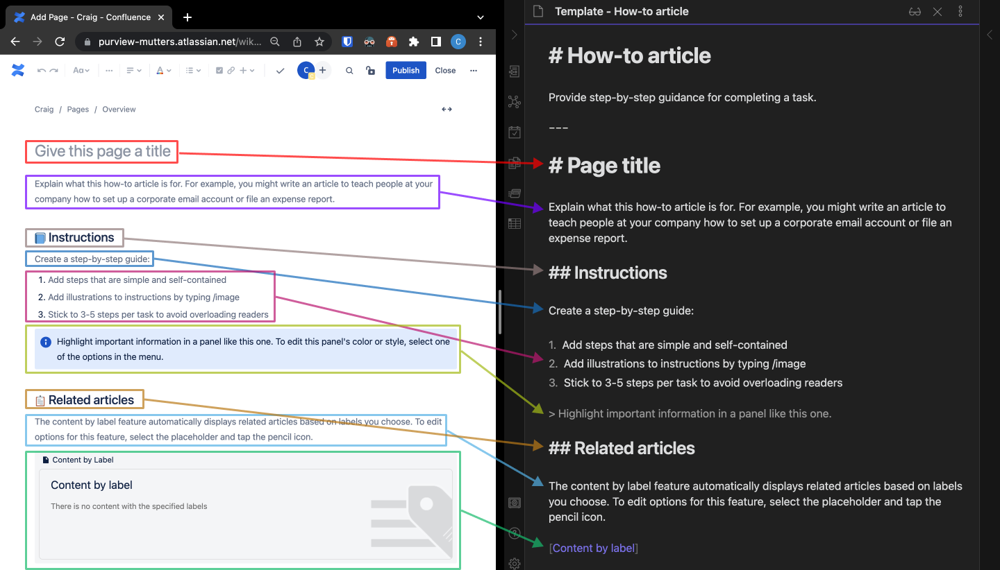

# Tutorial / Walkthrough
This is a tutorial that uses the `"How-to article"` template as an example.

## Step 1: Setting up the markdown document

1. Open your markdown editor and create a new `'.md'` file.

2. Name the markdown file after the template with the following structure: `"template_{TEMPLATE_NAME}.md"`.

> **Screenshot:**
> 
> 

3. Copy the following structure inside the newly created markdown document.

```
# {title}  
  
{description}
  
---

{template}
```

> **Screenshot:**
>
> 

## Step 2: Selecting and preparing the template

1. Scroll down and select your template from the list.

> **Screenshot:**
> 
> 

2. Copy the title of the template and paste it over the `"{title}"` tag inside your markdown document.

> **Screenshot:**
> 
> 

3. Copy the description of the template and paste it over the `"{description}"` tag inside your markdown document.

> **Screenshot:**
> 
> 

4. Click use template.

> **Example:**
> 
> 

5. Copy the template using `markdown` syntax in the `.md` file. Try to get the structure the same.

> **Example:**
> 
>

---

## The result
Below is the markdown document's final source code and a link to how it looks when it is rendered.

`template_how-to article.md`

```md title="template_how-to article"
# How-to article

Provide step-by-step guidance for completing a task.
  
---

# Page title

Explain what this how-to article is for. For example, you might write an article to teach people at your company how to set up a corporate email account or file an expense report.

## 📘 Instructions

Create a step-by-step guide:

1.  Add steps that are simple and self-contained
2.  Add illustrations to instructions by typing /image
3.  Stick to 3-5 steps per task to avoid overloading readers

> ℹ️ Highlight important information in a panel like this one.

## 📋 Related articles

The content by label feature automatically displays related articles based on labels you choose. To edit options for this feature, select the placeholder and tap the pencil icon.

[Content by label]
```

- [Click here to go to the How-to article ->](./template_how-to article.md)